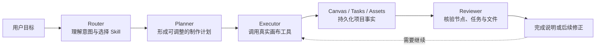

<p align="center">
  
</p>

<h1 align="center">Shotloom</h1>

<p align="center">
  <strong>面向 AI 影像创作的本地桌面工作台</strong>
  <br />
  在一张可视化画布上组织剧本、角色、分镜、图片、视频、声音与最终剪辑，<br />
  让 Agent 参与规划和执行，同时让每一步结果都保持可见、可编辑、可追踪。
</p>

<p align="center">
  
  
  
  
  
</p>

<p align="center">
  <a href="#核心能力">核心能力</a> ·
  <a href="#快速开始">快速开始</a> ·
  <a href="#agent-工作方式">Agent 工作方式</a> ·
  <a href="#技术架构">技术架构</a> ·
  <a href="#开发与构建">开发与构建</a>
</p>

---


> Shotloom 不是一个把提示词藏在聊天框里的生成器，而是一套以真实项目、真实节点和真实生成结果为基础的影像生产环境。

## 为什么是 Shotloom

传统 AI 创作工具往往把剧本、提示词、参考图、生成结果和修改记录分散在不同页面里。项目一旦进入多角色、多镜头或多阶段制作，创作者很快就会失去上下文：不知道素材来自哪里，也无法确认哪些结果真正完成。

Shotloom 将制作过程重新组织成一张持久化画布：

- 每个文本、图片、视频、音频和画板都是可引用的真实节点。
- 节点之间的连线表达输入关系、制作依赖与视觉约束。
- Copilot 可以理解完整画布、形成制作计划并通过受控工具实施操作。
- Skill 决定领域工作方式，Recipe 决定生成节点如何组织专业提示词。
- 项目任务、素材和生成结果在同一项目中归档，不依赖聊天记录维持事实。

它适合短剧、广告、口播、社交媒体内容、商品视觉以及更完整的影视化开发流程。

## 核心能力

### 无限画布式影像编排

在 React Flow 驱动的工作区中自由组织制作链路。画布支持缩放、框选、节点拖动、快捷键、历史操作以及自动布局，并提供以下节点：

- 图片生成
- 视频生成
- 音频生成
- 文本生成
- 3D 导演台
- 画板与便签
- 本地上传素材

节点引用会被保留为明确的输入职责，例如文本上下文、参考图和输入视频，而不是把所有附件无差别地拼进一次请求。

### 画布内 Copilot

Copilot 不只回答问题。它能够读取当前项目、选中节点和相关依赖，并根据用户要求：

- 分析已有画布和失败节点；
- 拆解剧本、场次、角色与镜头；
- 创建可调整的 Production Plan；
- 建立并连接真实画布节点；
- 调用已配置模型执行生成；
- 根据任务、文件和工具回执核验完成状态。

Agent Runtime 由 OpenCode sidecar 承载，通过本地工具桥与 Shotloom 通信。模型负责理解语义和选择工作流，应用层负责权限、事实、持久化与不可逆操作边界。

### 多模态生成协议

Shotloom 使用声明式模型目录描述不同厂商接口，而不是把供应商逻辑散落在界面代码中。每个模型可以独立定义：

- API endpoint、鉴权方式和请求模板；
- 文本、图片、视频与音频输入限制；
- 同步结果或异步任务轮询路径；
- 参数选项、默认值与输出能力；
- 厂商响应中的结果提取规则。

模型请求统一进入原生 Generation Gateway。凭据、代理、multipart 请求、超时和取消均由桌面层管理。

### 专业 Skill 与 Recipe

项目内置 8 套领域 Skill 和 48 套生成策略，覆盖：

- 全流程影像制作与连续短剧；
- 商业广告、主播口播与社媒内容；
- 商品视觉和关键帧动态编排；
- 原作分析、剧本改编、角色开发与镜头设计；
- 分镜、连续动作、声音方案和后期执行文档。

Skill 与 Recipe 可以在设置中查看、启停、编辑、导入和导出。内置内容通过版本迁移更新，同时保留用户的启用状态和本地自定义内容。

### 项目、素材与任务

每个项目拥有独立的画布、会话、任务和素材上下文：

- 项目库负责创建、组织、导入和恢复项目；
- 素材库按角色、场景、道具、风格和镜头管理可复用资产；
- 素材文件保留导入文件与生成结果；
- 项目任务展示真实执行状态、失败原因和输出记录；
- 项目可以导出为包含清单和实体文件的原生项目包。

### 3D 导演台

3D 导演台为镜头预演提供角色、摄影机、场景、道具和全景背景控制。它可以作为普通画布节点参与工作流，并把构图结果导出回项目。

### 内置视频编辑工作区

生成视频可以直接进入独立剪辑工作区。当前编辑能力包括：

- 多轨时间线与连续主轨；
- 视频预览、裁切和音量控制；
- 字幕与贴图轨道；
- 画布变换与文字样式；
- 转场、特效和桌面导出。

## 产品界面

<table>
  <tr>
    <td width="50%">
      
      <p align="center"><strong>项目库</strong><br /><sub>集中管理画布、文件夹与最近项目</sub></p>
    </td>
    <td width="50%">
      
      <p align="center"><strong>3D 导演台</strong><br /><sub>在画布中预演角色、摄影机与空间关系</sub></p>
    </td>
  </tr>
  <tr>
    <td colspan="2">
      
      <p align="center"><strong>视频编辑工作区</strong><br /><sub>从生成结果继续完成多轨剪辑、字幕设计与导出</sub></p>
    </td>
  </tr>
</table>

## Agent 工作方式

Shotloom 将语义决策与客观执行边界分开：模型理解创作目标，运行时保存并核验事实。



核心原则：

1. **语义交给模型**：不通过关键词、文本长度或节点数量猜测用户意图和制作复杂度。
2. **事实来自项目**：节点、任务、文件和工具回执必须真实存在，完成声明必须有结果支持。
3. **权限由运行时执行**：关闭“允许 Agent 运行节点”后，Agent 仍可规划画布，但不能启动付费生成。
4. **计划可调整**：Planner 只负责计划；Executor 通过真实工具实施；Reviewer 根据落地结果检查完整性。
5. **问题可以恢复**：可修正的工具问题返回给 Agent 继续处理，不因单个规划瑕疵终止整轮运行。

## 快速开始

### 环境要求

- Node.js 22.19.0 或更高版本
- npm 10 或更高版本
- Rust stable toolchain
- 对应平台的 Tauri 2 系统依赖

当前自动发布目标为 macOS Apple Silicon、macOS Intel 和 Windows x64。Linux 可以从源码开发构建，但目前不在正式 Release 矩阵中。

### 从源码启动桌面应用

```bash
git clone https://github.com/AstralFoundry/shotloom.git
cd shotloom
npm ci
npm run dev
```

`npm run dev` 会自动完成以下工作：

1. 从当前平台对应的 `opencode-*` npm 包准备 OpenCode sidecar；
2. 启动 Vite renderer；
3. 编译并运行 Tauri 桌面应用；
4. 监听前端和 Rust 代码变化。

首次 Rust 编译需要下载依赖，耗时会明显长于后续启动。

### 配置模型厂商

应用可以在不配置模型的情况下打开和管理项目。需要使用 Copilot 或生成节点时：

1. 打开左侧栏底部的 **设置**；
2. 进入 **API 厂商**；
3. 添加厂商连接并填写 API 地址与凭据；
4. 为文本、图片、视频和音频选择默认模型；
5. 回到画布运行节点或开始 Copilot 对话。

厂商配置按模型协议保存。新增模型默认使用空白协议，便于根据厂商官方 API 文档逐项配置请求和响应规则。


## 技术架构

| 层级 | 技术 | 职责 |
| --- | --- | --- |
| Desktop Shell | Tauri 2 · Rust | 窗口、文件系统、对话框、sidecar、更新与原生导出 |
| Renderer | React 19 · TypeScript · Vite | 产品界面、工作区和交互状态 |
| Canvas | React Flow | 节点、连线、选择、视口和工作流交互 |
| State | Zustand | 项目、画布、任务、设置、素材和会话状态 |
| Agent Runtime | OpenCode SDK + protected sidecar | Session、模型调用、Skill 路由和工具桥 |
| Generation | Native Generation Gateway | 凭据、请求编译、上传、轮询、取消和结果归档 |
| 3D | React Three Fiber · Drei · Three.js | 导演台、角色、摄影机与场景预演 |
| Video | OpenVideo Core · Pixi Engine | 多轨工程、预览、字幕、贴图与导出 |
| Quality | TypeScript · Node test runner | 类型检查、契约测试和行为回归 |

### 目录结构

```text
shotloom/
├── renderer/
│   ├── src/app/                 # React 工作台、画布、Copilot 与各业务页面
│   ├── src/agent/               # Agent Contract、Skill 与 OpenCode Runtime
│   ├── src/config/              # 模型目录与结构化动作契约
│   ├── src/domain/              # Provider、Catalog 和 Graph 领域边界
│   ├── src/services/            # 画布执行、生成网关适配与项目服务
│   └── src/store/               # 项目级持久化状态
├── src-tauri/
│   ├── src/commands/            # 文件、项目、Agent 与生成网关原生命令
│   ├── capabilities/            # Tauri 权限声明
│   └── tauri.conf.json          # 窗口、Bundle 与 sidecar 配置
├── scripts/                     # 平台 sidecar 准备脚本
├── tests/                       # 契约和行为回归测试
└── .github/workflows/           # CI 与跨平台 Release 流程
```

## 开发与构建

### 常用命令

| 命令 | 用途 |
| --- | --- |
| `npm run dev` | 启动完整 Tauri 桌面开发环境 |
| `npm run dev:web` | 仅启动 Vite renderer，适合界面调试 |
| `npm run check` | 顺序执行 TypeScript 检查和全部测试 |
| `npm run typecheck` | 运行 `tsc --noEmit` |
| `npm test` | 运行 Node 测试套件 |
| `npm run build` | 构建 renderer 生产资源 |
| `npm run build:desktop` | 构建当前平台桌面安装包 |
| `npm run prepare:opencode` | 准备当前平台的 OpenCode sidecar |

### 桌面构建

```bash
npm ci
npm run check
npm run build:desktop
```

Sidecar 文件不进入 Git。构建前置脚本会从锁定版本的 npm 平台包复制对应可执行文件，并按照 Tauri 要求命名：

```text
src-tauri/binaries/opencode-<target-triple>[.exe]
```

CI 与 Release 工作流也会在 Cargo/Tauri 启动前执行同一准备步骤，避免 `externalBin` 缺失导致构建失败。

### 发布流程

推送 `v*` 标签会触发跨平台 Release：

- macOS arm64 DMG
- macOS x64 DMG
- Windows x64 NSIS 安装包

macOS 正式发布需要配置 Developer ID 证书、公证账号和 Team ID。工作流会在构建前检查签名变量，任一缺失都会明确终止对应平台任务。

## 数据与安全边界

- 项目、画布和素材以本地事实为准，不由聊天消息模拟完成状态。
- API 凭据与厂商请求由原生桌面层管理，不注入普通 WebView 业务代码。
- Agent 只能调用当前加载 Skill 可见的命名空间工具。
- 生成节点的模型、提示词、输入角色和参数通过统一契约校验。
- 付费执行受用户设置和权限策略约束；规划权限不会自动扩大为执行权限。
- 项目删除、文件覆盖和外部发送等操作应继续遵守明确授权边界。

## 当前状态

Shotloom 目前处于快速迭代阶段，内部契约、模型目录和编辑能力仍可能演进。提交修改前建议运行：

```bash
npm run check
cargo check --manifest-path src-tauri/Cargo.toml --lib
```

如果修改 Agent 行为，请同步检查 `AGENTS.md`、相关 Skill、Recipe、Contract 和回归测试，保持 Router、Planner、Executor、Reviewer 与 Runtime/Store 的职责边界清晰。

---

<p align="center">
  <sub>Shotloom · Weave every shot into a production-ready story.</sub>
</p>
