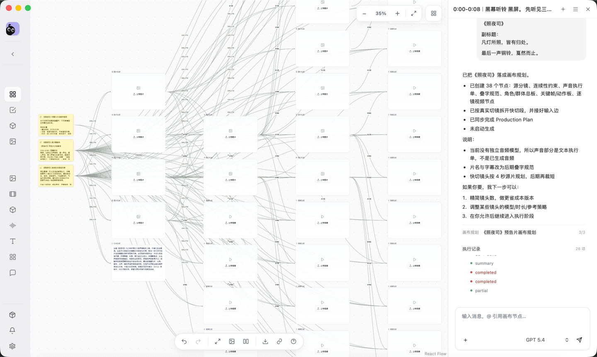
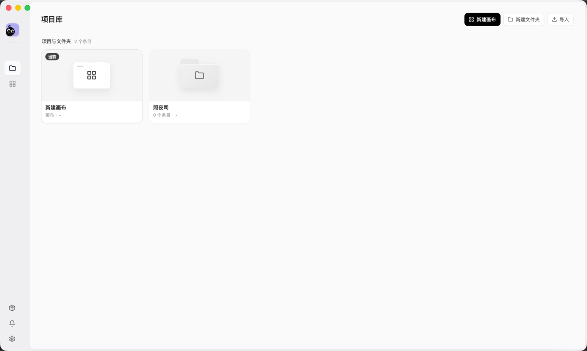
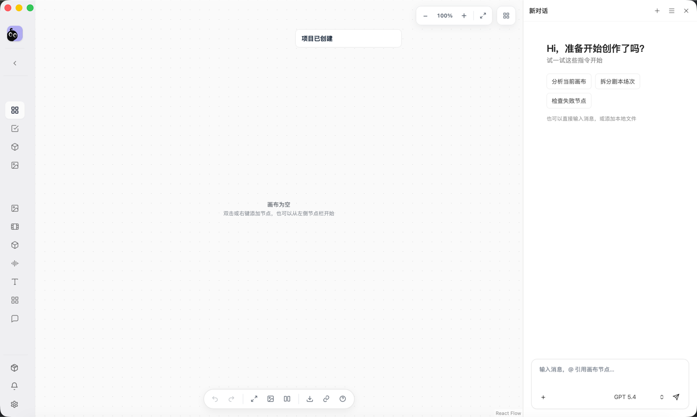
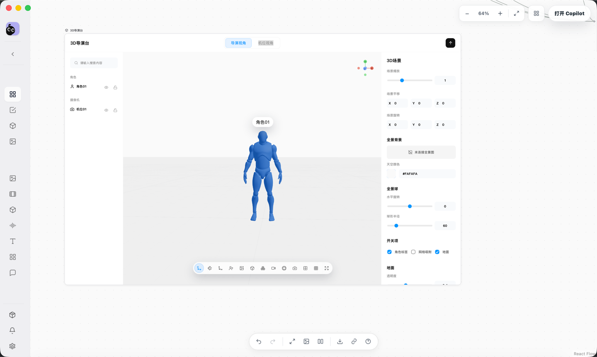
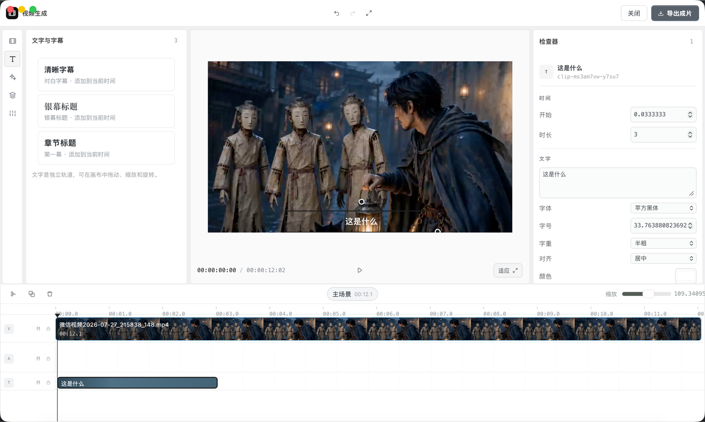

<p align="center">
  
</p>

<h1 align="center">织帧画布</h1>

<p align="center">
  <strong>别让 AI 作品停留在聊天记录里。</strong>
</p>

<p align="center">
  织帧画布 是面向 AI 影像创作者的桌面工作台——<br />
  把散落的提示词、参考图、生成结果和创作意图，<br />
  <strong>编织成一部真正可交付的作品</strong>，而不是散落各处、难以追溯的生成结果。
</p>

<p align="center">
  <a href="#-为什么是-shotloom">为什么是 Shotloom</a> ·
  <a href="#-能力一览">能力一览</a> ·
  <a href="#-界面预览">界面预览</a> ·
  <a href="#-快速开始">快速开始</a> ·
  <a href="#-开发">开发</a>
</p>

---

<br />



<br />

## 🤔 为什么是 织帧画布

用 AI 做影像创作，最难的其实不是「生成一张好图」。

真正困难的，是**第三张之后**——当你生成了几十个版本，灵感在聊天窗口里来回滚动，参考图和结果散落在下载目录的各个角落，你已经分不清哪个版本是基于哪条提示词、用了哪张参考图、应该进剪辑还是进废纸篓。

然后你打开剪辑软件，把勉强选出的几段拖进去，发现风格不统一、构图接不上——于是回到聊天窗口，再生成几版。循环往复。

**织帧画布 把这个循环变成一条直线。**

| 你现在的困境 | 织帧画布 的做法 |
|---|---|
| 提示词散落在聊天记录里 | 画布上的每个节点记录完整的提示词、参数与来源 |
| 生成的素材堆满下载文件夹 | 素材自动归属到项目，始终可预览、可溯源 |
| 不知道 A 图和 B 图是什么关系 | 连线表达参考、迭代与依赖，一眼看清整条链路 |
| 生成归生成，剪辑归剪辑 | 从灵感到导出，在一个工具里自然走完 |
| AI 助手对你的项目一无所知 | 助手直接读取画布上下文，给你针对性建议 |

**织帧画布 不是又一个 AI 生图工具。** 它是 AI 影像创作缺失的那一层——把提示词、素材、生成和后期串起来的工作台。

<br />

## 🎯 能力一览

<table>
  <tr>
    <td width="50%">
      <h3>🎨 可视化创作画布</h3>
      <p>像整理创意墙一样组织整条制作链路。文本、图片、视频、音频节点自由排布，连线表达上下文和依赖关系。支持缩放、框选、多选、拖拽、撤销、自动布局——以及直接拖入本地素材并即时预览。</p>
    </td>
    <td width="50%">
      <h3>🤖 AI 创作助手</h3>
      <p>不是通用聊天机器人。助手能读取你当前项目和画布内容，理解你在做什么、做到哪一步了。它能创建和连接节点、分析创作瓶颈、配合 Skill 和生成策略帮你把这一步走完——你看到的不是一段回复，而是画布上多出来的那几张图。</p>
    </td>
  </tr>
  <tr>
    <td width="50%">
      <h3>🌀 多模态生成</h3>
      <p>文字构思 → 静态画面 → 动态镜头 → 声音。在同一个工作区里衔接不同模态的模型。支持文本、图片、视频和音频模型，可配置不同 API 厂商和参数。参考图和视频输入直接来自画布上的节点，生成结果自动回到项目中。</p>
    </td>
    <td width="50%">
      <h3>📦 项目与素材管理</h3>
      <p>素材不再是无家可归的文件。素材设定（人物的外貌、场景的风格）和真实素材文件分开管理，支持项目内素材和本机通用素材。导入一个项目包，它就真的是一个完整的项目——不是一堆需要手动整理的文件夹。</p>
    </td>
  </tr>
  <tr>
    <td width="50%">
      <h3>🎬 3D 导演台</h3>
      <p>在生成之前，先想清楚机位、空间和角色关系。在三维场景中摆放角色、道具和摄影机，用画布上游的图片做场景参考。导出构图结果，继续用于后续节点——生成不再是开盲盒。</p>
    </td>
    <td width="50%">
      <h3>✂️ 视频编辑器</h3>
      <p>生成不是终点。多轨时间线、连续视频主轨、字幕、贴图、转场、画面变换、音量控制——在同一个应用里把可用镜头变成成片。最终直接从桌面导出视频文件。</p>
    </td>
  </tr>
</table>

<br />

## 📸 界面预览

<table>
  <tr>
    <td width="50%">
      
      <p align="center"><strong>项目库</strong> — 创建、整理和打开本地项目</p>
    </td>
    <td width="50%">
      
      <p align="center"><strong>创作画布</strong> — 组织节点、素材关系与生成任务</p>
    </td>
  </tr>
  <tr>
    <td width="50%">
      
      <p align="center"><strong>3D 导演台</strong> — 预演摄影机、角色与空间关系</p>
    </td>
    <td width="50%">
      
      <p align="center"><strong>视频编辑器</strong> — 剪辑、字幕、音效与导出</p>
    </td>
  </tr>
</table>

<br />

## 🚀 快速开始

### 你需要准备

- **Node.js** ≥ 22.19.0，**npm** ≥ 10
- **Rust** stable toolchain
- 对应平台的 [Tauri 2 系统依赖](https://v2.tauri.app/start/prerequisites/)

### 三行跑起来

```bash
git clone https://github.com/AstralFoundry/shotloom.git
cd shotloom
npm ci && npm run dev
```

首次启动会编译 Rust 依赖，泡杯咖啡等一会儿。后续启动就很快了。

只想调试前端界面？

```bash
npm run dev:web
```

浏览器模式不提供文件系统访问、原生导出和本地运行能力，完整体验请用桌面版。

### 接上模型

不接模型也能用来建项目和整理素材。要用生成节点或 AI 助手时：

1. 打开左侧栏 **设置 → API 厂商**
2. 添加厂商，填写 API 地址和凭据
3. 配置模型协议与参数
4. 为文本、图片、视频、音频分别选择默认模型

不同厂商的接口有差异，以官方 API 文档为准。

<br />

## 🛠 开发

| 命令 | 做什么 |
|---|---|
| `npm run dev` | 启动 Tauri 桌面开发环境 |
| `npm run dev:web` | 仅启动前端 dev server |
| `npm run typecheck` | TypeScript 类型检查 |
| `npm test` | 运行测试 |
| `npm run check` | 类型检查 + 测试 |
| `npm run build` | 构建前端资源 |
| `npm run build:desktop` | 构建桌面应用 |

### 技术栈

| 层 | 选型 |
|---|---|
| 桌面框架 | Tauri 2 / Rust |
| 前端 | React 19 / TypeScript / Vite |
| 画布 | React Flow |
| 状态管理 | Zustand |
| 3D 渲染 | React Three Fiber / Three.js |
| 视频引擎 | OpenVideo Core / Pixi |

---

<p align="center">
  <sub>织帧画布 · Weave every shot into a production-ready story.</sub>
</p>
